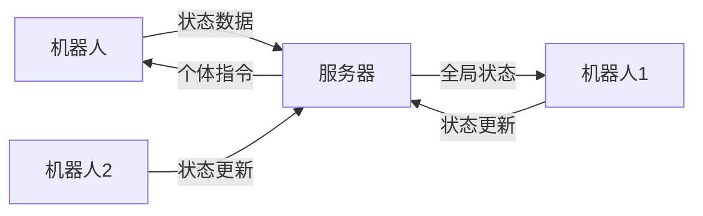
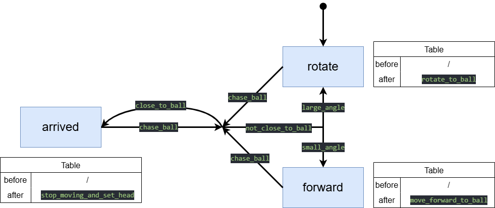
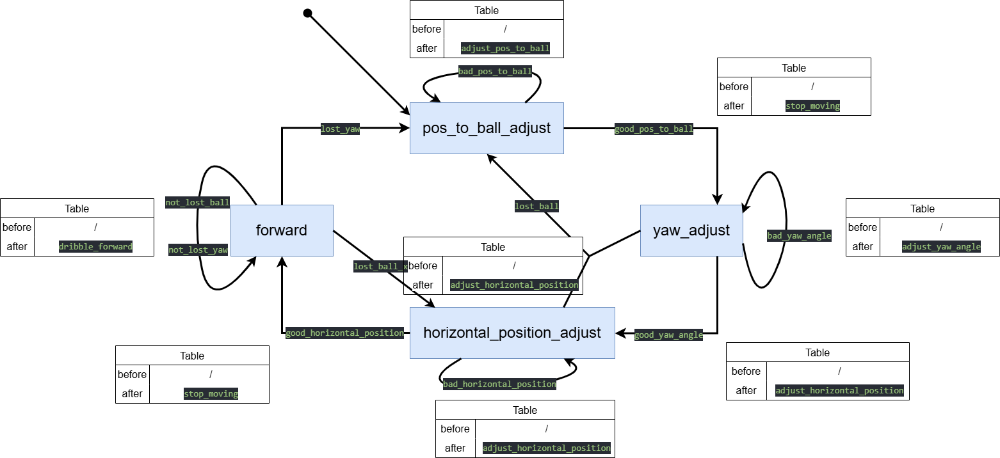
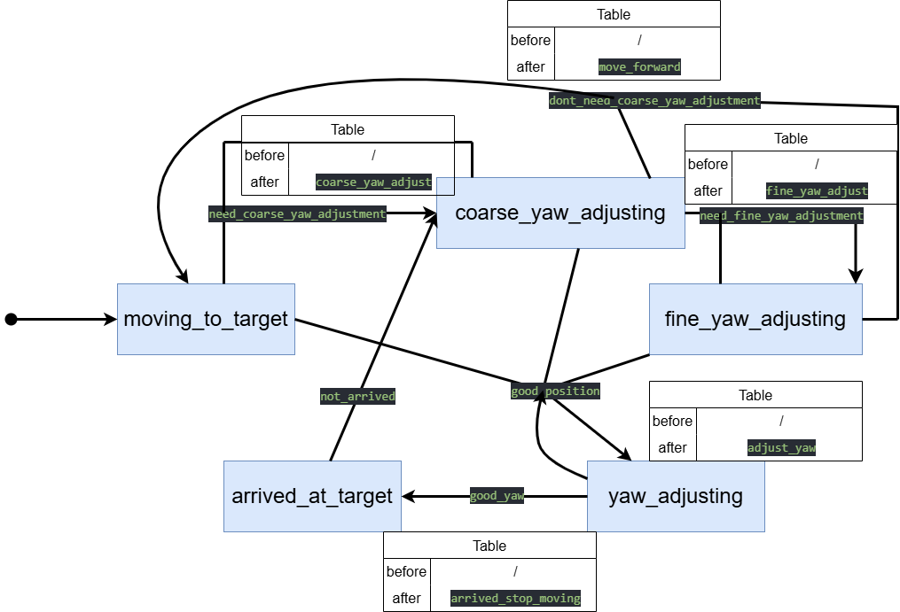
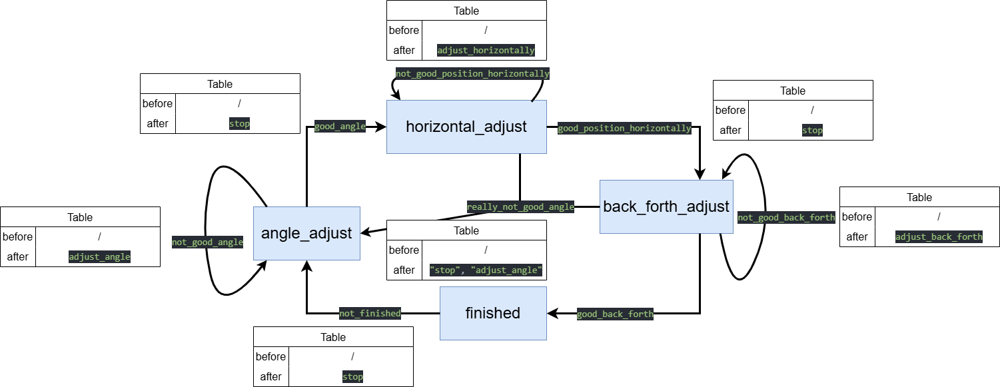
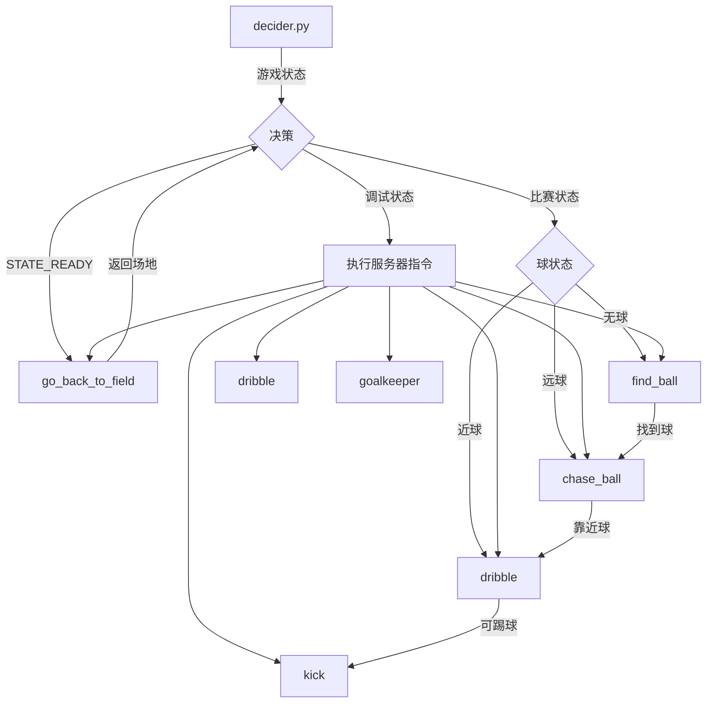

# MOS-Brain

The structure of messages and statemachines of MOS-8.5.

## 消息传递逻辑分类及说明

### 1. 机器人向服务器发送的消息

**发出方**：机器人（客户端）  
**接收方**：决策服务器  
**消息内容**：

```json
{
  "id": 机器人ID,
  "data": {
    "x": 机器人x坐标,
    "y": 机器人y坐标,
    "ballx": 球x坐标（若无则为null）,
    "bally": 球y坐标（若无则为null）,
    "yaw": 机器人偏航角,
    "ball_distance": 到球距离,
    "if_ball": 是否看到球
  },
  "info": 当前执行的命令,
  "timestamp": 时间戳
}
```

**关键代码位置**：

- `robot_client.py`中的`send_robot_data()`方法
- 通过TCP发送到服务器8001端口

---

### 2. 服务器向机器人发送该机器人的消息

**发出方**：决策服务器  
**接收方**：特定机器人  
**消息内容**：

```json
{
  "command": "指令名称",
  "data": {
    // 指令专用参数（示例）：
    "aim_x": 目标x坐标,    // go_back_to_field专用
    "aim_y": 目标y坐标,    // go_back_to_field专用
    "aim_yaw": 目标角度,   // go_back_to_field专用
    "chase_distance": 追踪距离 // chase_ball专用
  },
  "send_time": 发送时间戳
}
```

**支持的指令**：

- `dribble`（带球）
- `stop`（停止）
- `find_ball`（找球）
- `chase_ball`（追球）
- `kick`（踢球）
- `go_back_to_field`（返回场地）
- `goalkeeper`（守门）

**关键代码位置**：

- `decider_server_new.py`中的`publish_command()`方法
- 通过TCP发送到机器人8002端口

---

### 3. 服务器向机器人发送其他机器人的消息

**发出方**：决策服务器  
**接收方**：所有连接的机器人  
**消息内容**：

```json

{
  "robots_data": {
    "机器人ID1": {
      "id": 机器人ID,
      "last_seen": 最后可见时间,
      "status": "connected/disconnected",
      "data": { 
        "ballx": 球x坐标（若无则为null）,
        "bally": 球y坐标（若无则为null）,
      }
    },
    "机器人ID2": { ... },
    // ... 所有其他机器人的状态
  }
}
```

**关键特性**：

- 包含场上所有机器人的最新状态
- 每0.5秒广播一次（可配置）
- 机器人用此数据计算全局球位置

**关键代码位置**：

- `robot_server.py`中的`send_all_robots_data_loop()`方法
- 通过TCP广播到所有机器人的8002端口

---

### 消息流向示意图



### 关键设计说明

1. **双端口通信**：
   - 8001端口：机器人→服务器（状态上报）
   - 8002端口：服务器→机器人（指令/全局状态下发）

2. **状态同步机制**：
   - 服务器用`robots_data`字段聚合所有机器人状态
   - 机器人通过`get_ball_pos_in_map_from_other_robots()`计算全局球位置

3. **超时处理**：
   - 5秒未收到更新标记为`disconnected`
   - 指令发送超时0.5秒（可配置）

4. **角色管理**：
   - 服务器维护`roles_to_id`映射（前锋/后卫/守门员）
   - 可通过`switch_players_role()`动态切换角色

## 状态机转换说明

### 关键状态机逻辑

1. **追球 (`chase_ball.py`)**:
   - 状态：`rotate` → `forward` → `arrived`
   - 条件：
     - `close_to_ball()` → 停止移动
     - `large_angle()` → 旋转
     - `small_angle()` → 前进

2. **带球 (`dribble.py`)**:
   - 状态：`forward` ↔ `pos_to_ball_adjust` ↔ `yaw_adjust` ↔ `horizontal_position_adjust`
   - 条件：
     - `lost_ball()` → 位置调整
     - `good_yaw_angle()` → 水平调整
     - `good_horizontal_position()` → 前进

3. **返回场地 (`go_back_to_field.py`)**:
   - 状态：`moving_to_target` ↔ `coarse_yaw_adjusting` ↔ `fine_yaw_adjusting` → `arrived_at_target`
   - 条件：
     - `need_coarse_yaw_adjustment()` → 粗调角度
     - `good_position()` → 精调角度

4. **踢球 (`kick.py`)**:
   - 状态：`angle_adjust` → `horizontal_adjust` → `back_forth_adjust` → `finished`
   - 完成时执行 `self.agent.kick()`

### chase_ball



### dribble



### find_ball


### go_back_to_field



### goalkeeper

暂无

### kick



## 决策逻辑说明

### 核心逻辑（`decider.py`）

1. **初始化阶段**：
   - 创建 `Agent` 实例
   - 加载所有状态机：

     ```python
     self.chase_ball_state_machine = sub_statemachines.ChaseBallStateMachine(self)
     self.find_ball_state_machine = sub_statemachines.FindBallStateMachine(self)
     self.kick_state_machine = sub_statemachines.KickStateMachine(self)
     self.go_back_to_field_state_machine = sub_statemachines.GoBackToFieldStateMachine(self)
     self.dribble_state_machine = sub_statemachines.DribbleStateMachine(self)
     self.goalkeeper_state_machine = sub_statemachines.GoalkeeperStateMachine(self)
     ```

2. **状态机执行映射**：

   ```python
   self._state_machine_runners = {
       "chase_ball": self.chase_ball_state_machine.run,
       "find_ball": self.find_ball_state_machine.run,
       "kick": self.kick_state_machine.run,
       "go_back_to_field": self.go_back_to_field_state_machine.run,
       "dribble": self.dribble_state_machine.run,
       "goalkeeper": self.goalkeeper_state_machine.run,
       "stop": self.stop,
   }
   ```

3. **决策流程**：

   ```python
   def run(self):
       state = self.receiver.game_state
       if state != "STATE_PLAYING":
           self.stop()
       elif state == 'STATE_READY':
           self._state_machine_runners['go_back_to_field']()  # 返回场地
       else:
           if time.time() - self._last_command_time > self.offline_time:
               if not self.get_if_ball():
                   self._state_machine_runners['find_ball']()  # 找球
               elif self.get_ball_distance() > 0.6:
                   self._state_machine_runners['chase_ball']()  # 追球
               else:
                   self._state_machine_runners['dribble']()  # 带球
           else:
               cmd = self._command["command"]
               if cmd in self._state_machine_runners:
                   self._state_machine_runners[cmd]()  # 执行服务器指令
   ```

### 状态机间调用关系



### 执行特点

1. **优先级**：
   - 游戏状态 > 服务器指令 > 自主决策
   - 返回场地（`STATE_READY`）优先级最高

2. **状态机切换条件**：

   ```python
   # 追球 → 带球
   if self.get_ball_distance() <= 0.6:
       self._state_machine_runners['dribble']()
   
   # 带球 → 踢球
   if self.if_can_kick and good_back_forth():
       self._state_machine_runners['kick']()
   ```

3. **异常处理**：

   ```python
   try:
       # 主逻辑
   except Exception as e:
       self._state_machine_runners['find_ball']()  # 异常时默认找球
   ```

### 配置文件依赖

所有状态机通过 `self._config = self.agent.get_config()` 获取参数，例如：

```python
# chase_ball.py
self.close_angle_threshold_rad = chase_config.get("close_angle_threshold_rad", 0.1)
self.walk_vel_x = chase_config.get("walk_vel_x", 0.3)

# dribble.py
self.forward_vel = self._config.get("dribble", {}).get("walk_vel_x", 0.1)
```
