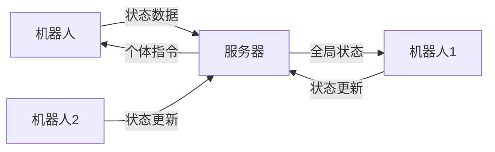
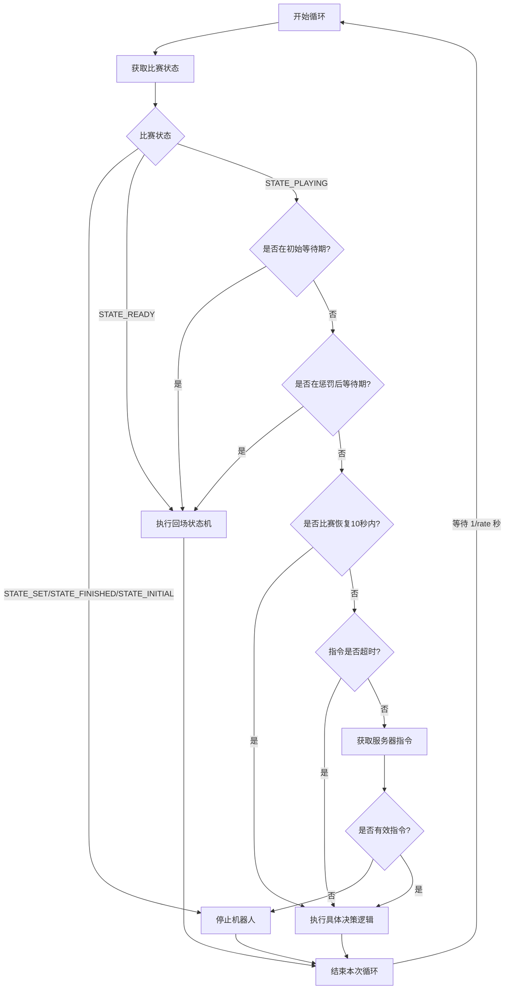
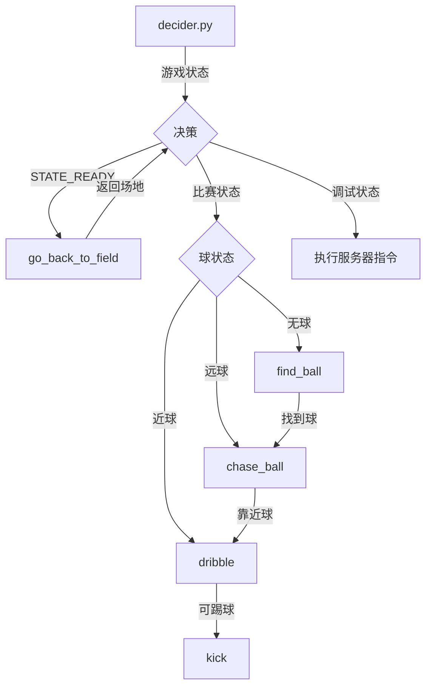

# MOS-Brain

The structure of messages and statemachines of MOS-8.5.

## 消息传递逻辑分类及说明

### 1. 机器人向服务器发送的消息

**发出方**：机器人（客户端）  
**接收方**：决策服务器  
**消息内容**：

```json
{
  "id": 机器人ID,
  "data": {
    "x": 机器人x坐标,
    "y": 机器人y坐标,
    "ballx": 球x坐标（若无则为null）,
    "bally": 球y坐标（若无则为null）,
    "yaw": 机器人偏航角,
    "ball_distance": 到球距离,
    "if_ball": 是否看到球
  },
  "info": 当前执行的命令,
  "timestamp": 时间戳
}
```

**关键代码位置**：

- `robot_client.py`中的`send_robot_data()`方法
- 通过TCP发送到服务器8001端口

---

### 2. 服务器向机器人发送该机器人的消息

**发出方**：决策服务器  
**接收方**：特定机器人  
**消息内容**：

```json
{
  "command": "指令名称",
  "data": {
    // 指令专用参数（示例）：
    "aim_x": 目标x坐标,    // go_back_to_field专用
    "aim_y": 目标y坐标,    // go_back_to_field专用
    "aim_yaw": 目标角度,   // go_back_to_field专用
    "chase_distance": 追踪距离 // chase_ball专用
  },
  "send_time": 发送时间戳
}
```

**支持的指令**：

- `dribble`（带球）
- `stop`（停止）
- `find_ball`（找球）
- `chase_ball`（追球）
- `kick`（踢球）
- `go_back_to_field`（返回场地）
- `goalkeeper`（守门）

**关键代码位置**：

- `decider_server_new.py`中的`publish_command()`方法
- 通过TCP发送到机器人8002端口

---

### 3. 服务器向机器人发送其他机器人的消息

**发出方**：决策服务器  
**接收方**：所有连接的机器人  
**消息内容**：

```json

{
  "robots_data": {
    "机器人ID1": {
      "id": 机器人ID,
      "last_seen": 最后可见时间,
      "status": "connected/disconnected",
      "data": { 
        "ballx": 球x坐标（若无则为null）,
        "bally": 球y坐标（若无则为null）,
      }
    },
    "机器人ID2": { ... },
    // ... 所有其他机器人的状态
  }
}
```

**关键特性**：

- 包含场上所有机器人的最新状态
- 每0.5秒广播一次（可配置）
- 机器人用此数据计算全局球位置

**关键代码位置**：

- `robot_server.py`中的`send_all_robots_data_loop()`方法
- 通过TCP广播到所有机器人的8002端口

---

### 消息流向示意图



### 关键设计说明

1. **双端口通信**：
   - 8001端口：机器人→服务器（状态上报）
   - 8002端口：服务器→机器人（指令/全局状态下发）

2. **状态同步机制**：
   - 服务器用`robots_data`字段聚合所有机器人状态
   - 机器人通过`get_ball_pos_in_map_from_other_robots()`计算全局球位置

3. **超时处理**：
   - 5秒未收到更新标记为`disconnected`
   - 指令发送超时0.5秒（可配置）

4. **角色管理**：
   - 服务器维护`roles_to_id`映射（前锋/后卫/守门员）
   - 可通过`switch_players_role()`动态切换角色

## 决策逻辑说明

### 总体框架

1. **程序入口：`main()`函数**
2. **解析命令行参数：支持`--debug`和`--rate`参数，分别用于启用调试模式和设置循环频率（默认10Hz）**
3. **创建Agent实例：`agent = Agent()`**
   - 初始化ROS节点，节点名为"decider"。
   - 加载配置文件（`configuration.load_config()`）。
   - 读取一些参数（通过`read_params`方法）。
   - 初始化一些状态变量，如命令、上次命令时间、机器人数据等。
   - 注册接口：
     - `interfaces.action.Action`：用于控制机器人（行走、踢球等）。
     - `interfaces.vision.Vision`：用于获取视觉信息（自身位置、球位置等）。
   - 创建`Receiver`实例：用于接收来自服务器的信息（如游戏状态、处罚时间等）。
   - 创建`RobotClient`实例：用于与服务器通信。
   - 初始化各个状态机（位于sub_statemachines模块中）。
   - 构建状态机运行器字典（`_state_machine_runners`），将命令字符串映射到对应的状态机运行函数。
   - 记录开始时间等。

4. **设置信号处理：捕获SIGINT信号（Ctrl+C）以退出**
5. **根据设定的频率（由`--rate`指定，默认10Hz）进入循环：**
   - 如果启用调试模式（`--debug`），则调用`agent.debug_run()`。
   - 否则，调用`agent.run()`。
   - 每次循环后睡眠以维持频率（间隔为1/rate秒）。
6. **捕获KeyboardInterrupt异常（用户中断）时，打印信息并退出**
7. **最后，无论是否发生异常，都会调用`agent.stop()`停止机器人**

### 循环部分框架



### 配置文件依赖

所有状态机通过 `self._config = self.agent.get_config()` 获取参数

## 状态机说明

### 状态机间转换关系



### 关键状态机逻辑

1. **追球 (`chase_ball.py`)**:
   - 状态：`rotate` → `forward` → `arrived`
   - 条件：
     - `close_to_ball()` → 停止移动
     - `large_angle()` → 旋转
     - `small_angle()` → 前进

2. **带球 (`dribble.py`)**:
   - 状态：`forward` ↔ `pos_to_ball_adjust` ↔ `yaw_adjust` ↔ `horizontal_position_adjust`
   - 条件：
     - `lost_ball()` → 位置调整
     - `good_yaw_angle()` → 水平调整
     - `good_horizontal_position()` → 前进

3. **返回场地 (`go_back_to_field.py`)**:
   - 状态：`moving_to_target` ↔ `coarse_yaw_adjusting` ↔ `fine_yaw_adjusting` → `arrived_at_target`
   - 条件：
     - `need_coarse_yaw_adjustment()` → 粗调角度
     - `good_position()` → 精调角度

4. **踢球 (`kick.py`)**:
   - 状态：`angle_adjust` → `horizontal_adjust` → `back_forth_adjust` → `finished`
   - 完成时执行 `self.agent.kick()`

### chase_ball


### dribble


### find_ball


### go_back_to_field


### goalkeeper

暂无

### kick


