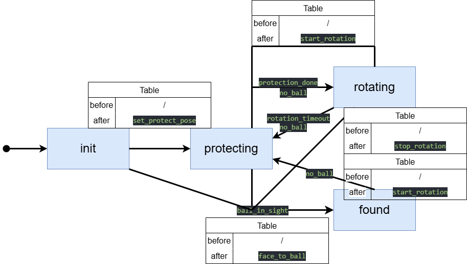

# MOS-Brain

The structure of messages and statemachines of MOS-8.5.

## 消息传递逻辑分类及说明

### 1. 机器人向服务器发送的消息

**发出方**：机器人（客户端）  
**接收方**：决策服务器  
**消息内容**：

```json
{
  "id": 机器人ID,
  "data": {
    "x": 机器人x坐标,
    "y": 机器人y坐标,
    "ballx": 球x坐标（若无则为null）,
    "bally": 球y坐标（若无则为null）,
    "yaw": 机器人偏航角,
    "ball_distance": 到球距离,
    "if_ball": 是否看到球
  },
  "info": 当前执行的命令,
  "timestamp": 时间戳
}
```

**关键代码位置**：

- `robot_client.py`中的`send_robot_data()`方法
- 通过TCP发送到服务器8001端口

---

### 2. 服务器向机器人发送该机器人的消息

**发出方**：决策服务器  
**接收方**：特定机器人  
**消息内容**：

```json
{
  "command": "指令名称",
  "data": {
    // 指令专用参数（示例）：
    "aim_x": 目标x坐标,    // go_back_to_field专用
    "aim_y": 目标y坐标,    // go_back_to_field专用
    "aim_yaw": 目标角度,   // go_back_to_field专用
    "chase_distance": 追踪距离 // chase_ball专用
  },
  "send_time": 发送时间戳
}
```

**支持的指令**：

- `dribble`（带球）
- `stop`（停止）
- `find_ball`（找球）
- `chase_ball`（追球）
- `kick`（踢球）
- `go_back_to_field`（返回场地）
- `goalkeeper`（守门）

**关键代码位置**：

- `decider_server_new.py`中的`publish_command()`方法
- 通过TCP发送到机器人8002端口

---

### 3. 服务器向机器人发送其他机器人的消息

**发出方**：决策服务器  
**接收方**：所有连接的机器人  
**消息内容**：

```json

{
  "robots_data": {
    "机器人ID1": {
      "last_seen": 最后可见时间,
      "status": "connected/disconnected",
      "data": { /* 同机器人上报的数据结构 */ }
    },
    "机器人ID2": { ... },
    // ... 所有其他机器人的状态
  }
}
```

**关键特性**：

- 包含场上所有机器人的最新状态
- 每0.5秒广播一次（可配置）
- 机器人用此数据计算全局球位置

**关键代码位置**：

- `robot_server.py`中的`send_all_robots_data_loop()`方法
- 通过TCP广播到所有机器人的8002端口

---

### 消息流向示意图


### 关键设计说明

1. **双端口通信**：
   - 8001端口：机器人→服务器（状态上报）
   - 8002端口：服务器→机器人（指令/全局状态下发）

2. **状态同步机制**：
   - 服务器用`robots_data`字段聚合所有机器人状态
   - 机器人通过`get_ball_pos_in_map_from_other_robots()`计算全局球位置

3. **超时处理**：
   - 5秒未收到更新标记为`disconnected`
   - 指令发送超时0.5秒（可配置）

4. **角色管理**：
   - 服务器维护`roles_to_id`映射（前锋/后卫/守门员）
   - 可通过`switch_players_role()`动态切换角色

## 状态机

### chase_ball


### dribble


### find_ball



### go_back_to_field


### goalkeeper

暂无

### kick


