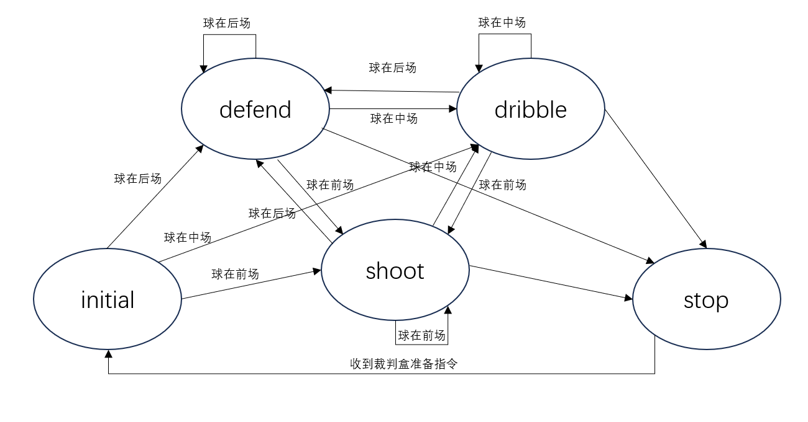
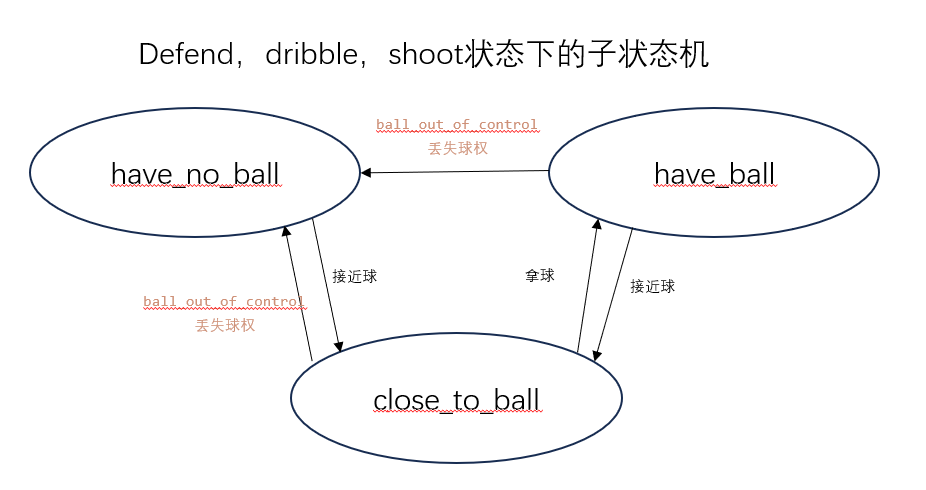

# 决策状态机说明

## 主状态机

主状态机共有initial, stop, shoot, dribble, defend五个状态，对应入场，停止，射门，向前盘带，防守五个子状态机。射门，向前盘带，防守三个状态之间的转移根据**球的位置**决定，initial和stop根据裁判盒消息决定。

## 其它子状态机

仅当在主状态机处于shoot, dribble, defend三个状态时，运行对应状态的子状态机执行射门，向前盘带，防守三个任务，结构如下： 

- 射门状态（shoot）: 有三个子状态：无球状态下前锋机器人都前去拿球，接近球状态下只有一个机器人前去拿球，拿球状态下直接射门；
- 向前盘带状态（dribble）: 有三个子状态：无球状态下前锋机器人都前去拿球，接近球状态下只有一个机器人前去拿球，拿球状态下两个前锋机器人进行向前盘带（拿球的盘带无球的向前走）；
- 防守状态（defend)：有三个子状态：无球状态下所有机器人都前去拿球，接近球状态下只有一个机器人前去拿球，拿球状态下两个前锋机器人进行向前盘带（拿球的盘带无球的向前走）,防守机器人归位；
